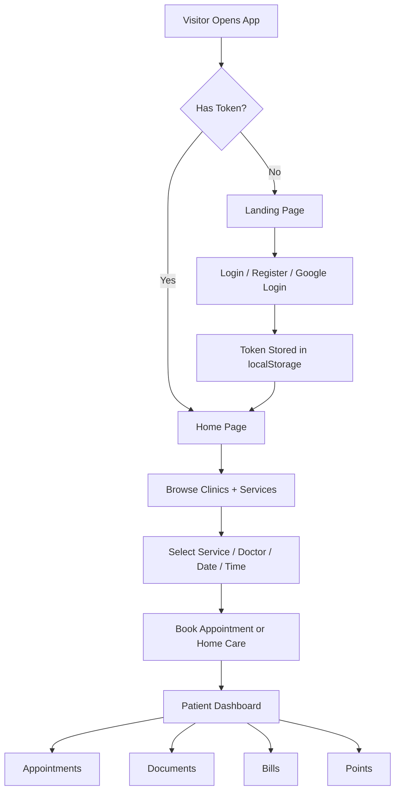

<div align="center">

# 🩺 Curawell Healthcare Platform

### A modern healthcare booking and patient dashboard web application

#### Built with React, Vite, Redux Toolkit, Tailwind CSS, Axios, and React Router

<br/>


<br/>

> **Patient-facing healthcare platform for clinic browsing, service booking, home care booking, appointment management, medical documents, bills, and reward points.**

</div>

---

## ⚠️ Healthcare Disclaimer

This project is for **educational and demonstration purposes only**.  
It is a frontend healthcare booking and dashboard interface and does **not** provide medical diagnosis, treatment decisions, or emergency medical support.

Real healthcare systems require secure backend validation, medical approval workflows, privacy protection, audit logging, role-based access control, and compliance with applicable healthcare regulations.

---

## 📌 Project Overview

**Curawell** is a React-based healthcare web application that allows users to explore medical services, register or log in, book clinic and home care appointments, view personal dashboard information, manage documents, review bills, and exchange points.

The project uses a modular frontend architecture with reusable components, Redux Toolkit slices for API-driven state management, protected routes for authenticated pages, and a custom visual design based on the Cairo font and Curawell brand colors.

### General Workflow



---

## ✨ Key Features

| Feature                         | Description                                                                 |
| ------------------------------- | --------------------------------------------------------------------------- |
| 🏥 **Clinic Browsing**          | Displays clinics, departments, doctors, FAQs, and service sections          |
| 🧑‍⚕️ **Doctor Discovery**       | Shows top doctors and service-specific doctors from backend API data        |
| 📅 **Appointment Booking**      | Lets patients select service, doctor, date, time slot, phone, and location  |
| 🏠 **Home Care Booking**        | Supports home care services with date, period, gender preference, and notes |
| 🔐 **Authentication Flow**      | Includes login, registration, OTP verification, reset password, and Google login |
| 🛡️ **Protected Routes**         | Uses token-based route guards for authenticated pages                       |
| 📊 **Patient Dashboard**        | Shows profile, medical data, doctors, sessions, appointments, and history   |
| 📂 **Medical Documents**        | Displays laboratory and radiology documents with prepared/pending statuses  |
| 💳 **Billing System UI**        | Shows clinic, home care, lab, and radiology bills with a chart summary      |
| 🎁 **Points System**            | Displays points balance, history, and exchange flow                         |
| 🔔 **Toast Notifications**      | Uses Sonner notifications for success and feedback messages                 |
| 🗺️ **Map + Location Support**   | Includes Leaflet-based map/location components                             |
| 🎨 **Responsive UI**            | Uses Tailwind CSS, sliders, cards, modals, loaders, and dashboard layouts   |

---

## 🖥️ UI Preview

> Add screenshots here after uploading the project to GitHub.

```text
screenshots/
├── landing-page.png
├── login-page.png
├── home-page.png
├── clinic-booking.png
├── home-care-booking.png
├── dashboard.png
├── appointments.png
├── documents.png
├── bills.png
└── points.png
```

Example Markdown for screenshots:

```md


```

---

## 🧠 Application Architecture

The frontend is organized around **pages, components, hooks, Redux slices, and API configuration**.

### Main App Entry

```jsx
createRoot(document.getElementById("root")).render(
  <StrictMode>
    <GoogleOAuthProvider clientId="GOOGLE_CLIENT_ID">
      <BrowserRouter>
        <Provider store={store}>
          <Toaster position="bottom-right" richColors />
          <App />
        </Provider>
      </BrowserRouter>
    </GoogleOAuthProvider>
  </StrictMode>
);
```

### Route Protection Idea

```jsx
const token = localStorage.getItem("token");

return token ? (
  <>
    <NavBar />
    <Outlet />
    <CurwellFooter />
  </>
) : (
  <Navigate to="/login" />
);
```

This means protected pages are only available after authentication.

---

## 🧭 Application Routes

### Public Routes

| Route             | Page / Component        | Purpose                         |
| ----------------- | ----------------------- | ------------------------------- |
| `/`               | Smart redirect          | Sends user to landing or home   |
| `/landing-page`   | `LandingPage`           | Public marketing page           |
| `/login`          | `LoginForm`             | User login                      |
| `/register`       | `RegisterForm`          | Multi-step registration         |
| `/googleLogin`    | `MedDeatails`           | Google login medical details    |
| `/resetpassword`  | `ResetPassword`         | Reset password flow             |

### Protected Main Routes

| Route                         | Page / Component         | Purpose                       |
| ----------------------------- | ------------------------ | ----------------------------- |
| `/home`                       | `HomePage`               | Authenticated home page       |
| `/clinicsPage`                | `ClinicsPage`            | Clinics and FAQ page          |
| `/contactUsPage`              | `ContactUs`              | Contact form / information    |
| `/cosmeticClinic/:serviceId`  | `CosmeticClinicsPage`    | Clinic service booking        |
| `/homeCare/:serviceId`        | `HomeCareCos`            | Home care booking             |

### Protected Dashboard Routes

| Route           | Page / Component      | Purpose                        |
| --------------- | --------------------- | ------------------------------ |
| `/dashboard`    | `Profile`             | Patient dashboard/profile      |
| `/appointments` | `AppointmentsPage`    | Appointment management         |
| `/documents`    | `DocumentsPage`       | Lab and radiology documents    |
| `/bills`        | `BillsPage`           | Bills and payment summaries    |
| `/points`       | `PointsPage`          | Points balance and exchange    |
| `/labratory`    | `Labratory`           | Laboratory service page        |
| `*`             | `NotFoundPage`        | 404 fallback                   |

---

## 🔐 Authentication System

The project includes several authentication-related flows:

| Flow                  | Main Files / Slices                                      |
| --------------------- | -------------------------------------------------------- |
| Login                 | `components/auth/LoginForm.jsx`, `features/auth/loginSlice.js` |
| Register              | `components/auth/RegisterForm.jsx`, `features/auth/registerSlice.js` |
| OTP Send / Verify     | `features/auth/otpSlice.js`                              |
| Reset Password        | `components/auth/ResetPassword.jsx`, `features/auth/resetPasswordSlice.js` |
| Google Login          | `components/auth/google/GoogleLOginButton.jsx`, `features/auth/googleSlice.js` |
| Protected Navigation  | `routes/ProtectedRoutes.jsx`, `routes/ProtectedRoutes2.jsx` |

### Token Storage

After login, the backend token is stored in local storage:

```js
localStorage.setItem("token", response.data.token);
```

Authenticated API calls use the token as a Bearer token:

```js
Authorization: `Bearer ${localStorage.getItem("token")}`
```

---

## 📅 Booking System

Curawell supports two main booking types.

### Clinic Appointment Booking

The clinic booking flow supports:

- Service selection
- Doctor selection
- Date selection
- Available time slot loading
- Phone number input
- Location input
- Website / location toggle
- Toast feedback after booking

Related files:

```text
src/components/clinics/CosmeticClinicsPage.jsx
src/components/clinics/components/BookingPanel.jsx
src/components/clinics/components/ClinicDoctorsSection.jsx
src/hooks/useCosmetic.js
src/features/data/cosmeticSlice.js
```

### Home Care Booking

The home care booking flow supports:

- Home care service selection
- Gender preference selection
- Date selection
- Period/time selection
- Location information
- Patient phone validation
- Notes and booking submission

Related files:

```text
src/components/clinics/HomeCareCos.jsx
src/components/clinics/components/HomeCareBooking.jsx
src/components/clinics/components/HomeCareKeyServices.jsx
src/hooks/useHomeCareCos.js
src/features/data/cosmeticSlice.js
```

---

## 📊 Redux State Management

The app uses **Redux Toolkit** with async thunks for API calls.

### Store Slices

| Slice Key            | Reducer File                                      | Responsibility                    |
| -------------------- | ------------------------------------------------- | --------------------------------- |
| `login`              | `features/auth/loginSlice.js`                     | Login/logout state                |
| `register`           | `features/auth/registerSlice.js`                  | Registration state                |
| `otp`                | `features/auth/otpSlice.js`                       | OTP send/verify state             |
| `resetPassword`      | `features/auth/resetPasswordSlice.js`             | Reset password state              |
| `googleLogin`        | `features/auth/googleSlice.js`                    | Google login state                |
| `homeData`           | `features/data/homeSlice.js`                      | Home page data                    |
| `landingData`        | `features/data/landingPageSlice.js`               | Landing page data                 |
| `clinicsData`        | `features/data/clinicsSlice.js`                   | Clinics, doctors, FAQs           |
| `cosmeticData`       | `features/data/cosmeticSlice.js`                  | Services, doctors, offers, booking |
| `navBarData`         | `features/data/navBarSlice.js`                    | Navbar sections and clinics       |
| `dashBoardData`      | `features/data/dashboard/dashBoardSlice.js`       | Profile, doctors, sessions, appointments |
| `appointmentsData`   | `features/data/dashboard/appointmentsSlice.js`    | Full appointment management       |
| `documentsData`      | `features/data/dashboard/documentsSlice.js`       | Lab and radiology documents       |
| `pointsData`         | `features/data/dashboard/pointsSlice.js`          | Points balance and exchange data  |
| `billsData`          | `features/data/dashboard/billsSlice.js`           | Billing information               |

---

## 🌐 API Integration

The project uses Axios instances for public and authenticated requests.

### Public Axios Instance

```js
const axiosInstance = axios.create({
  baseURL: "http://127.0.0.1:8000/api",
  headers: {
    "Content-Type": "application/json",
    "Accept-Language": "en",
  },
});
```

### Authenticated Axios Instance

```js
const axiosInstanceR = axios.create({
  baseURL: "http://127.0.0.1:8000/api",
  headers: {
    "Content-Type": "application/json",
    "Accept-Language": "en",
    Authorization: `Bearer ${localStorage.getItem("token")}`,
  },
});
```

### Important Backend Endpoints Used

| Endpoint                              | Purpose                         |
| ------------------------------------- | ------------------------------- |
| `/login`                              | User login                      |
| `/register`                           | User registration               |
| `/logout`                             | User logout                     |
| `/googleLogin`                        | Google authentication           |
| `/auth/send-code`                     | Send OTP                        |
| `/auth/verify-code`                   | Verify OTP                      |
| `/auth/reset-password`                | Reset password                  |
| `/get_sections`                       | Service sections                |
| `/get_clinics`                        | Clinics list                    |
| `/get_Top_doctors`                    | Top doctors                     |
| `/get_discounts`                      | Offers and discounts            |
| `/get_articles`                       | Articles                        |
| `/get_comments`                       | Patient comments                |
| `/get_questions`                      | FAQs                            |
| `/Info-center`                        | Intro/about content             |
| `/Info-contact_us`                    | Contact information             |
| `/doctors_services`                   | Clinic key services             |
| `/services_section`                   | Home care services              |
| `/competence_doctors`                 | Doctors by competence/service   |
| `/day_and_sessions`                   | Clinic appointment sessions     |
| `/period_homeCare`                    | Home care appointment periods   |
| `/reserve_appointment`                | Reserve clinic appointment      |
| `/reserve_appointment_HC`             | Reserve home care appointment   |
| `/profile`                            | Patient profile                 |
| `/appointments`                       | Patient dashboard appointments  |
| `/all_appointments`                   | Full appointments list          |
| `/sessions`                           | Medical sessions / diagnosis data |
| `/myDoctors`                          | Patient doctors                 |
| `/dashboard/patient/analyses`         | Laboratory documents            |
| `/dashboard/patients/skiagraph_orders`| Radiology documents             |
| `/rates_bill`                         | Bills and payment data          |
| `/get_points`                         | Points data                     |

---

## 🎨 UI Design System

The project uses a custom Tailwind theme with Curawell colors and the Cairo font.

```css
@theme {
  --color-curawell: #972e6a;
  --color-grayc: #f8f9fa;
  --color-blimo: #22ccb2;
  --font-cairo: Cairo, "sans-serif";
}
```

### UI Libraries Used

| Library                | Usage                                      |
| ---------------------- | ------------------------------------------ |
| `tailwindcss`          | Utility-first styling                      |
| `daisyui`              | Extra component styling                    |
| `framer-motion`        | Motion and animation                       |
| `gsap`                 | Advanced animations                        |
| `react-slick`          | Sliders/carousels                          |
| `swiper`               | Patient feedback carousel                  |
| `react-day-picker`     | Appointment date picker                    |
| `sonner`               | Toast notifications                        |
| `recharts`             | Bills and dashboard charts                 |
| `leaflet` / `react-leaflet` | Map and location features             |
| `lucide-react`         | Icons                                      |
| `react-icons`          | Icon components                            |
| `fontawesome`          | Font Awesome icons                         |

---

## 📁 Project Structure

```text
Curawell-main/
│
├── index.html
├── package.json
├── package-lock.json
├── vite.config.js
├── eslint.config.js
├── README.md
│
├── public/
│   ├── vite.svg
│   └── images/
│       ├── cosmi.png
│       ├── cosmictic.png
│       └── lo1go.png
│
└── src/
    ├── App.jsx
    ├── main.jsx
    ├── index.css
    ├── store.js
    │
    ├── assets/
    │   ├── fonts/Cairo/
    │   ├── home.png
    │   ├── login.png
    │   ├── register.png
    │   ├── offers.png
    │   ├── clinics.png
    │   └── ...
    │
    ├── components/
    │   ├── NavBar.jsx
    │   ├── CurwellFooter.jsx
    │   ├── SideBar.jsx
    │   ├── TopBar.jsx
    │   ├── LogoLoader.jsx
    │   ├── ContactUs.jsx
    │   │
    │   ├── auth/
    │   │   ├── LoginForm.jsx
    │   │   ├── RegisterForm.jsx
    │   │   ├── ResetPassword.jsx
    │   │   ├── Register/
    │   │   ├── google/
    │   │   └── miniComponents/
    │   │
    │   ├── landingPage/
    │   │   ├── LandingPage.jsx
    │   │   ├── IntroducingSection.jsx
    │   │   ├── ServicesSection.jsx
    │   │   ├── AboutClinics.jsx
    │   │   ├── DoctorsSection.jsx
    │   │   ├── OffersSection.jsx
    │   │   └── ContactSection.jsx
    │   │
    │   ├── home/
    │   │   ├── HomePage.jsx
    │   │   ├── SpecializedSlider.jsx
    │   │   ├── OffersSlider.jsx
    │   │   └── PatientsFeedPacks.jsx
    │   │
    │   ├── clinics/
    │   │   ├── ClinicsPage.jsx
    │   │   ├── CosmeticClinicsPage.jsx
    │   │   ├── HomeCareCos.jsx
    │   │   ├── Labratory.jsx
    │   │   └── components/
    │   │
    │   └── userDashboard/
    │       ├── Profile.jsx
    │       ├── AppointmentsPage.jsx
    │       ├── DocumentsPage.jsx
    │       ├── BillsPage.jsx
    │       ├── PointsPage.jsx
    │       └── ...
    │
    ├── config/
    │   ├── axiosInstance.js
    │   └── axiosIntanceR.js
    │
    ├── context/
    │   ├── HomeContext.js
    │   └── StepperContext.js
    │
    ├── features/
    │   ├── auth/
    │   └── data/
    │
    ├── hooks/
    │   ├── useLandingPage.js
    │   ├── useHomePage.js
    │   ├── useCosmetic.js
    │   ├── useHomeCareCos.js
    │   └── useUserDashboard.js
    │
    └── routes/
        ├── AppRoutes.jsx
        ├── ProtectedRoutes.jsx
        └── ProtectedRoutes2.jsx
```

---

## 🧩 File Responsibilities

| File / Folder                              | Responsibility                              |
| ------------------------------------------ | ------------------------------------------- |
| `src/main.jsx`                             | React app bootstrap, providers, router, store, toaster |
| `src/App.jsx`                              | Root component that renders app routes      |
| `src/routes/AppRoutes.jsx`                 | Defines public, protected, and dashboard routes |
| `src/routes/ProtectedRoutes.jsx`           | Protects main authenticated pages with navbar/footer |
| `src/routes/ProtectedRoutes2.jsx`          | Protects dashboard pages                    |
| `src/store.js`                             | Combines all Redux Toolkit reducers         |
| `src/config/axiosInstance.js`              | Public Axios API client                     |
| `src/config/axiosIntanceR.js`              | Authenticated Axios API client              |
| `src/components/auth/`                     | Login, registration, OTP, reset password, Google auth |
| `src/components/landingPage/`              | Public landing page sections                |
| `src/components/home/`                     | Authenticated home page sliders and sections |
| `src/components/clinics/`                  | Clinics, services, booking, laboratory, home care |
| `src/components/userDashboard/`            | Profile, appointments, documents, bills, points |
| `src/features/auth/`                       | Authentication Redux slices                 |
| `src/features/data/`                       | Public and protected data Redux slices      |
| `src/hooks/`                               | Reusable UI and data logic hooks            |
| `src/assets/`                              | Images, logos, screenshots, custom fonts    |

---

## ⚙️ Installation

### 1. Clone the repository

```bash
git clone https://github.com/your-username/curawell.git
cd curawell
```

### 2. Install dependencies

```bash
npm install
```

### 3. Configure backend API URL

The current project points to a local backend:

```js
http://127.0.0.1:8000/api
```

Update these files if your backend uses another URL:

```text
src/config/axiosInstance.js
src/config/axiosIntanceR.js
```

### 4. Configure Google OAuth

The Google OAuth provider is configured in:

```text
src/main.jsx
```

Replace the current client ID with your own Google OAuth client ID when deploying or using a different environment.

---

## 📦 Requirements

Example dependencies from `package.json`:

```text
react
react-dom
vite
@vitejs/plugin-react
@reduxjs/toolkit
react-redux
react-router-dom
axios
tailwindcss
@tailwindcss/vite
daisyui
framer-motion
gsap
react-day-picker
react-slick
slick-carousel
swiper
sonner
recharts
leaflet
react-leaflet
@react-oauth/google
jwt-decode
lucide-react
react-icons
@fortawesome/fontawesome-free
```

---

## ▶️ Running the Project

### Run development server

```bash
npm run dev
```

Default Vite local URL:

```text
http://localhost:5173
```

Depending on your Vite output, the app may also run on:

```text
http://127.0.0.1:5173
```

### Build for production

```bash
npm run build
```

### Preview production build

```bash
npm run preview
```

### Run ESLint

```bash
npm run lint
```

---

## 🧪 Example User Flow

```text
1. Open the app.
2. If no token exists, the app redirects to /landing-page.
3. Register a new user or log in.
4. After successful login, the token is saved in localStorage.
5. The user is redirected to /home.
6. The user browses clinics, offers, doctors, and services.
7. The user opens a clinic service page.
8. The user selects service, doctor, date, and available time.
9. The user submits the appointment booking.
10. The user opens dashboard pages to view appointments, documents, bills, and points.
```

---

## ✅ Suggested Test Cases

| #   | Case                                | Expected Result                         |
| --- | ----------------------------------- | --------------------------------------- |
| 1   | Open `/` without token              | Redirects to `/landing-page`            |
| 2   | Open `/home` without token          | Redirects to `/login`                   |
| 3   | Login with valid credentials        | Token saved and protected pages open    |
| 4   | Login with invalid credentials      | Error message appears                   |
| 5   | Register with missing fields        | Validation prevents invalid submission  |
| 6   | Send OTP                            | OTP API request is triggered            |
| 7   | Reset password                      | Reset password API flow is triggered    |
| 8   | Browse clinics page                 | Clinics, doctors, and FAQs are loaded   |
| 9   | Select clinic service               | Key services and doctors are displayed  |
| 10  | Select appointment date             | Available sessions are loaded           |
| 11  | Book clinic appointment             | Success toast appears                   |
| 12  | Book home care appointment          | Home care booking request is sent       |
| 13  | Open dashboard                      | Profile, doctors, sessions, and appointments load |
| 14  | Open documents page                 | Laboratory and radiology documents load |
| 15  | Open bills page                     | Bills summary and tables appear         |
| 16  | Open points page                    | Points balance and history appear       |
| 17  | Logout                              | Token removed and user returns to login |
| 18  | Unknown route                       | Not found page appears                  |

---

## 🔎 Important Developer Notes

### Backend Required

This frontend expects a backend API running at:

```text
http://127.0.0.1:8000/api
```

Without the backend, pages that depend on API data may stay in loading state or show empty sections.

### Token Handling

The authenticated Axios instance reads the token from `localStorage` when the module is loaded. If token refresh or dynamic token updates are needed, consider using Axios interceptors.

### Environment Variables Recommended

For production, it is better to move backend URLs and OAuth IDs into environment variables:

```text
VITE_API_BASE_URL=https://your-api-domain.com/api
VITE_GOOGLE_CLIENT_ID=your-google-client-id
```

Then read them with:

```js
import.meta.env.VITE_API_BASE_URL
import.meta.env.VITE_GOOGLE_CLIENT_ID
```

### Naming Note

Some current file names contain spelling inconsistencies, such as:

```text
Labratory.jsx
Appoimtments/
BasicDeatails.jsx
MedicalDeatails.jsx
GoogleLOginButton.jsx
axiosIntanceR.js
```

They work as long as imports match, but renaming them later may improve maintainability.

---

## 🛣️ Future Improvements

- Move API base URL and Google client ID to `.env`
- Add Axios interceptors for token refresh and automatic logout
- Add role-based access for patient, doctor, and admin dashboards
- Add stronger form validation using a validation library
- Add loading skeletons for dashboard cards and tables
- Add unit/integration tests with Vitest and React Testing Library
- Add end-to-end tests with Playwright or Cypress
- Add multilingual support for Arabic and English UI switching
- Improve accessibility and keyboard navigation
- Add real screenshot previews to README
- Add appointment cancellation and rescheduling confirmation dialogs
- Add secure file preview/download handling for medical documents
- Add admin dashboard for clinics, services, doctors, and offers
- Add deployment instructions for Vercel, Netlify, or Docker

---

## 👨‍💻 Author

Developed as an educational healthcare frontend project using:

- React
- Vite
- Redux Toolkit
- React Router
- Tailwind CSS
- Axios
- Healthcare booking and patient dashboard concepts

<div align="center">

### ⭐ If this project helps you, consider starring the repository.

</div>
